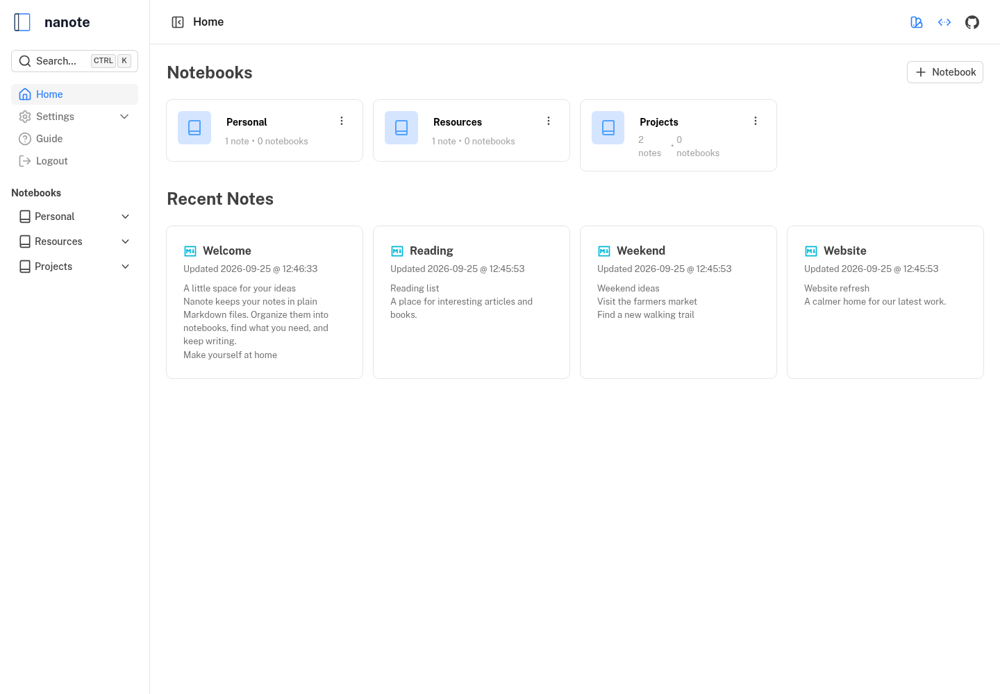
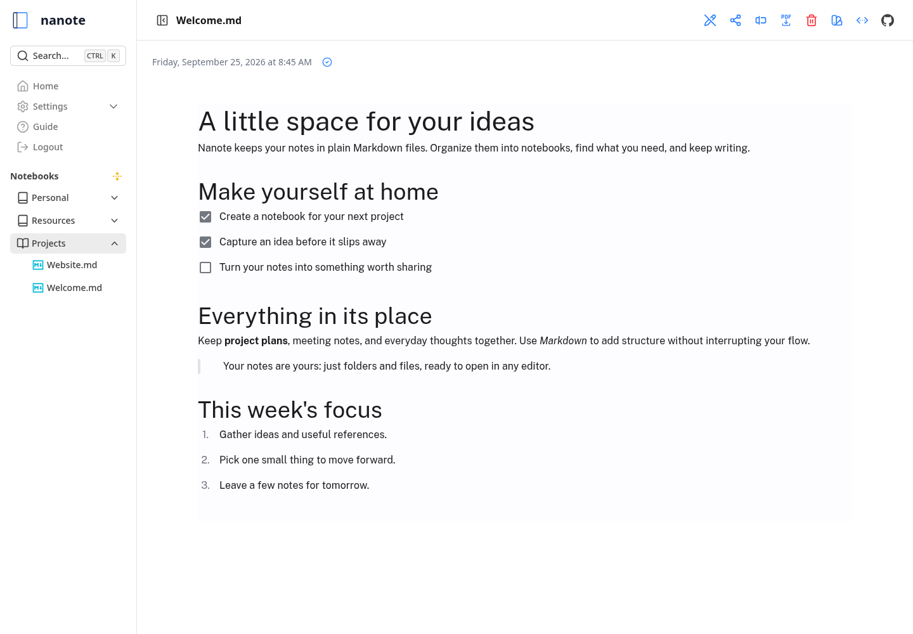

# Nanote

A lightweight, self-hosted note-taking application with filesystem-based storage. Built with Nuxt 4, TypeScript, and designed for simplicity and performance. The primary goal of this app is to manage your notes in a manner that is 100% portable. You should be able to manage your notes in terminal, notepad or any other app - there is no database, just folders and files.

**Auth** : If you don't set the SECRET_KEY environment variable the default secret key is `nanote` though you should set your own key

## Screenshots

### Home



### Note editor



## Features

- 📂 **Notebook-based Organization** - Folders as notebooks, markdown files as notes
- 🔍 **Universal Search** - Fast content search across all notes (OS-optimized)
- 📄 **Markdown Support** - Native .md file handling with proper MIME types
- 🔒 **Local Storage** - No databases for notes - uses your existing filesystem
- 🐳 **Docker Ready** - Full container support with sample compose file
- 🔧 **TypeSafe API** - Fully typed REST endpoints with validation
- 🚀 **Performance** - Optimized file operations and platform-specific search
- 📱 **Mobile friendly** - Mobile friendly layout for viewing and editing notes

### Custom Remark Directives

If you type in certain commands in text, they will be handled by the UI:

- `::file` will create an inline file picker allowing you to upload files (remember to set the upload path in the environment variables)
- `::fileBlock` will create an file block (a larger icon taking up the whole line) picker allowing you to upload files (remember to set the upload path in the environment variables)
- `::today` will show today's date
- `::now` will show todays's date and time
- `::tomorrow` will show tomorrow's date
- `::yesterday` will show yesterday's date
- `::time` will show the time right now

### Pending

- [ ] **Archive** - Archive notes and notebooks
- [ ] **Rollup checklists** - Rollup checklist items from all their notes into its own page for easier task management
- [x] **File upload** - Images done, need one for file
- [ ] **Encryption** - Note/Notebook encryption at rest
- [ ] **Apps** - Mobile/desktop apps (possibly via PWA)

## Getting Started

### Docker

You can use the following published image with the compose file

```bash
omarmir/nanote
```

OR

You can clone the repo, build the image and run the compose file. You will need ugrep installed/added to path.

```bash
git clone https://github.com/omarmir/nanote.git
cd nanote
docker build -t nanote .
```

Edit the compose file (specifically the volume mount point and environment variables):

```yml
environment:
  - NOTES_PATH=/nanote/notes
  - UPLOAD_PATH=/nanote/uploads
  - CONFIG_PATH=/nanote/config
  - SECRET_KEY=<yourkey>
volumes:
  - /path/to/local/uploads/nanote/volume:/nanote
```

If these are not set then the app will save files locally within itself. The notes environment variable is where it will save your notes, and uploads is where any attachments are stored.

```bash
docker compose -d up
```

### Prerequisites

- Node.js 18+
- PNPM 8+
- Docker (optional)

### Tech stack

- Nuxt3 and Vue
- Pinia
- Tailwind 3
- Milkdown (as the main editor)

### Contributing

Right now, the place that needs the most help is the home page, it's hard to read so some help there would be appreciated. Open an issue and discuss the issue first. Nanote is distributed under the GNU Affero General Public License.

### Translations

Use the language menu beside the GitHub icon to switch between English, French, and Simplified Chinese. Your choice is saved in a browser cookie.

Translation files are in [`i18n/locales`](i18n/locales). You can edit `zh-CN.json` directly to change Chinese wording. To add another language, copy `en.json`, translate its values while preserving keys and placeholders such as `{note}`, and register the new file in `nuxt.config.ts` under `i18n.locales`.

### Local Development

```bash
# Clone repository
git clone https://github.com/omarmir/nanote.git
cd nanote

# Install dependencies
pnpm install

# Start development server
pnpm run dev
```

### API

The nanote server does expose an API and this will be documented better in the future, the app is in VERY early stages so things are still liable to shift. I am now daily driving this for my notes so its not going anywhere and you should expect updates.
